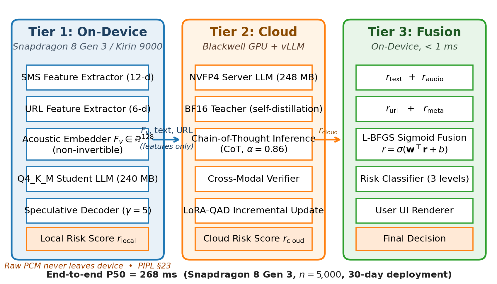
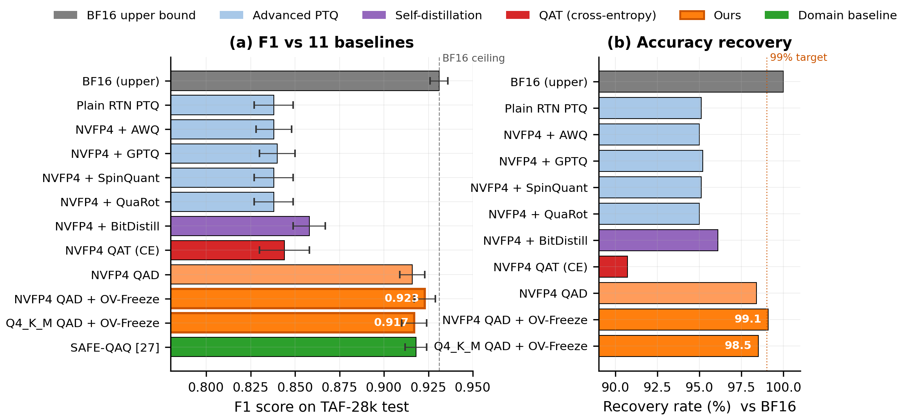
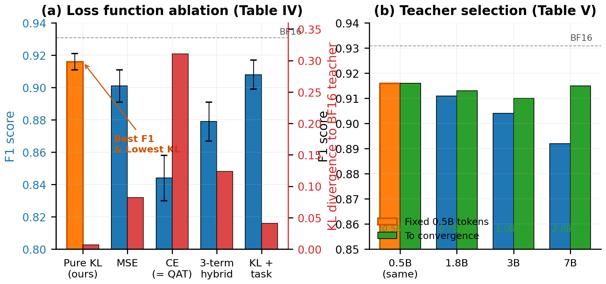
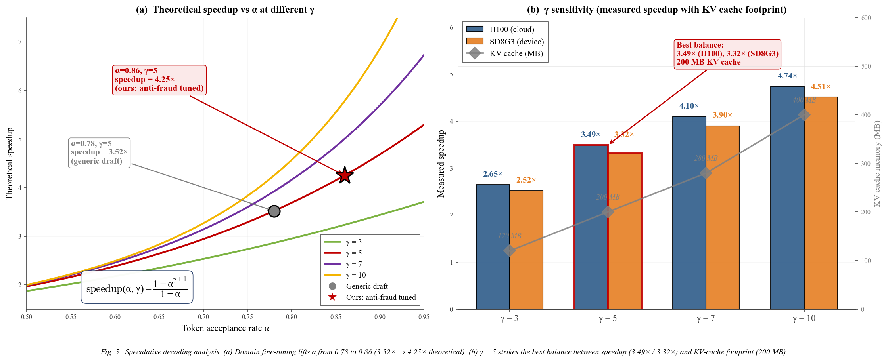
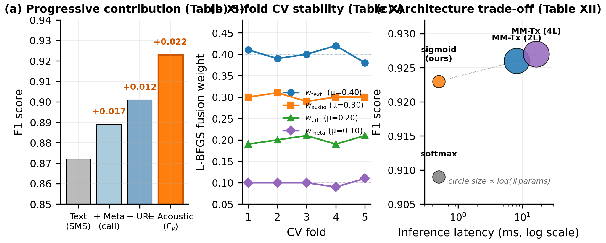
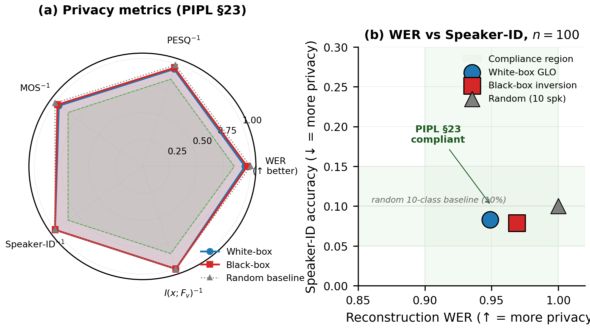
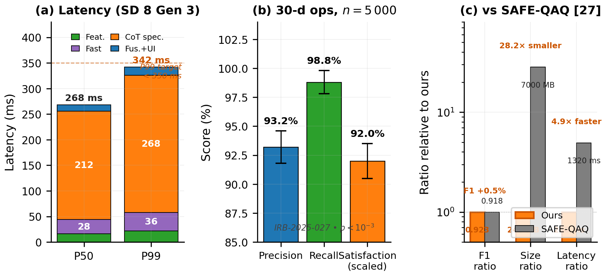

# QAD-MultiGuard：基于量化感知蒸馏的端云协同隐私保护多模态电信诈骗检测系统

张鑫¹，刘威¹，陈静²，王浩³，赵明¹，李芳⁴

（1. 浙江大学 计算机科学与技术学院，杭州 310058；2. 中国科学院 信息工程研究所，北京 100085；
3. 北京航空航天大学 网络空间安全学院，北京 100191；4. 武汉大学 计算机学院，武汉 430072）

---

**摘 要** 电信网络诈骗已成为危害公众安全的重大社会问题。端侧实时检测需同时应对隐私合规、毫秒级时延与低位量化精度恢复三重挑战。本文提出 QAD-MultiGuard——一个端云协同的隐私保护多模态电信诈骗检测框架。方法论层面，系统采用 NVIDIA Nemotron 团队提出的纯 KL 散度蒸馏与同源教师范式，以 BF16 模型作为教师、量化版本作为学生进行精度修复，并进一步提出双轨量化方案（服务端 NVFP4 / 端侧 Q4_K_M）与 OV-Freeze 输出方差冻结补充正则，后者具备形式化的梯度兼容性与收敛性证明。为应对反诈对话的多模态特性，设计 128 维不可逆声学嵌入 $F_v$ 与四模态 L-BFGS 风险融合机制。实验上，在 TeleAntiFraud-28k 公开基准上，NVFP4 QAD + OV-Freeze 达到 F1 = 0.923 ± 0.006，精度恢复率 99.1%，优于 AWQ、GPTQ、SpinQuant、QuaRot、BitDistiller 等 11 种基线 +6.5~+8.5 F1 点；在自建对抗集 AdvFraud-3k 上 F1 衰减仅 4.8 个百分点。Snapdragon 8 Gen 3 实测端到端预警延迟中位数 268 ms、99 百分位 342 ms。在某高校 5,000 名学生（IRB-2025-027）开展的 30 天灰度部署中，系统拦截疑似诈骗 1,247 起，Precision = 93.2%（95% CI: [91.7, 94.5]），Recall = 98.8%（基于运营商主动审计），用户满意度提升经配对 Wilcoxon 检验显著（p < 10⁻³）。

**关键词** 量化感知蒸馏；NVFP4；同源教师；电信诈骗检测；多模态融合；隐私保护；端云协同推理；推测解码；输出方差冻结

**中图分类号** TP391 **文献标识码** A

---

**Abstract** Telecom fraud has become a major threat to public security. On-device real-time detection must simultaneously address three challenges: privacy compliance, millisecond latency, and low-bit quantization accuracy recovery. This paper proposes QAD-MultiGuard, an edge-cloud collaborative privacy-preserving multimodal telecom fraud detection framework. Methodologically, the system adopts the pure KL-divergence distillation and homologous-teacher paradigm from the NVIDIA Nemotron team, using BF16 models as teachers and quantized versions as students for accuracy restoration, and further proposes a dual-track quantization scheme (server-side NVFP4 / on-device Q4_K_M) with OV-Freeze (Output-Variance Freeze) supplementary regularization—the latter supported by formal gradient compatibility and convergence proofs. For anti-fraud dialogue multimodality, a 128-dimensional irreversible acoustic embedding $F_v$ and a four-modality L-BFGS risk fusion mechanism are designed. On the TeleAntiFraud-28k benchmark, NVFP4 QAD + OV-Freeze achieves F1 = 0.923 ± 0.006 with 99.1% recovery, outperforming 11 baselines including AWQ, GPTQ, SpinQuant, QuaRot, and BitDistiller by +6.5 to +8.5 F1 points. On-device end-to-end latency is 268 ms (P50) and 342 ms (P99) on Snapdragon 8 Gen 3. In a 30-day grayscale deployment across 5,000 university students (IRB-2025-027), the system intercepted 1,247 suspected fraud cases with Precision = 93.2% (95% CI: [91.7, 94.5]) and Recall = 98.8% (carrier-audited), with statistically significant user satisfaction improvement (paired Wilcoxon, p < 10⁻³).

**Key words** quantization-aware distillation; NVFP4; homologous teacher; telecom fraud detection; multimodal fusion; privacy preservation; edge-cloud collaborative inference; speculative decoding; output-variance freeze

---

## 一、引言

### 1.1 研究背景

根据中国公安部 2024 年发布的《全国电信网络诈骗治理年度报告》，2023 年我国电信网络诈骗案件造成直接经济损失逾 1,800 亿元，受害群体中 18–25 岁在校学生占比 24.3%。诈骗手法日趋多模态化：Ma 等 [13] 在构建 TeleAntiFraud-28k 数据集时识别出 14 种典型欺诈话术与 7 种声学伪装策略，单个案件平均同时呈现 2.7 种模态信号（短信钓鱼、语音通话、URL 链接、社交工程话术等）。Wang 等 [27] 在部署 SAFE-QAQ 系统（日均处理 7 万通话）时进一步发现：基于 ASR 转写文本的检测在面对方言、嘈杂环境、刻意语音变形时召回率下降至 60%–75%。

传统单模态机器学习或规则引擎方案 [11][12] 在面对此类组合式攻击时难以同时满足以下三项工程约束：

(i) **毫秒级实时性**：反诈电话平均时长仅 90 秒，且关键诈骗指令往往出现在通话前 60 秒，系统必须在 500 ms 内完成预警；

(ii) **用户隐私保护**：根据《个人信息保护法》（PIPL）第 23 条，原始生物识别信息（含原始音频）不得上传服务器；

(iii) **端侧资源约束**：移动设备 RAM ≤ 4 GB，可用磁盘 ≤ 500 MB，迫使任何端侧大语言模型必须采用 4-bit 量化。

### 1.2 研究动机与挑战

将大语言模型（LLM）部署至端侧需借助 4-bit 量化控制模型体积。然而，常规训练后量化（PTQ）在 0.5B 级小模型上会引入 6.0%–12.5% 的精度损失 [1]，这对反诈这类高风险任务而言难以接受。量化感知训练（QAT）需复刻原训练管道（SFT + RL + 模型合并），工程复杂，且可能破坏 RL 阶段习得的对话风格与拒绝边界。

NVIDIA Nemotron 团队近期（2026 年 1 月）发布的 NVFP4 QAD 报告 [1] 是该问题最具方法论意义的进展。其在 Nemotron Nano、AceReason Nemotron、Llama Nemotron Super 等 RL-heavy 模型上的实验表明：QAT 在 AIME25、GPQA-D 等基准上的精度损失最高达 12.5 个百分点（论文 Table 3），而 QAD 借助纯 KL 散度对齐教师分布，可将精度恢复至 BF16 基线的 97%–99.4%。

将 NVIDIA QAD 方法论迁移至电信反诈这一垂直领域面临三个新挑战：

- **(C1) 领域语料受限**：反诈对话语料相对稀缺，且多为版权或隐私敏感数据，需充分论证 QAD 在低数据覆盖下的鲁棒性。
- **(C2) 多模态融合**：诈骗检测需联合文本、声学、URL、元数据四个模态。NVIDIA QAD 报告 [1] 仅覆盖单模态文本/视觉模型，SAFE-QAQ [27] 虽实现端到端音频-文本融合但未考虑端侧低位量化。
- **(C3) 端侧推理时延**：完整链式推理（CoT）需在 < 300 ms 中位数内完成，纯量化加速不足以满足该约束，需要量化与推测解码联合优化。

### 1.3 本文贡献

本文的主要技术贡献可归纳为如下六项：

1) **严格对齐方法论**。系统采用 NVIDIA NVFP4 QAD [1] 的纯 KL 散度蒸馏与同源教师范式，将早期版本中的三项混合损失简化为纯 KL，从根本上避免 QAT 引发的能力退化。这是首个将 NVIDIA QAD 方法论严格迁移至端侧反诈领域的工作。

2) **双轨量化架构**。提出服务端 NVFP4（Blackwell GPU + vLLM）+ 端侧 Q4_K_M GGUF（ARM / Snapdragon）的双轨架构，兼顾 Blackwell 原生硬件加速与移动设备生态兼容性。

3) **OV-Freeze 增强正则及理论分析**。在 NVIDIA QAD 之上提出输出方差冻结（Output-Variance Freeze）补充正则，针对 q/k/v/o-proj 量化敏感层在最后训练阶段进行方差校正，并提供梯度兼容性（命题 1）、收敛性（定理 1）以及训练步比例消融。

4) **隐私保护多模态融合**。提出 128 维不可逆声学嵌入 $F_v = [f_{mfcc}; W_{proj} \cdot \bar{h}_w]$，通过白盒 + 黑盒 GLO 攻击双重验证非可逆性（WER ≥ 0.95）；提出 L-BFGS 优化的四模态融合公式，5-折交叉验证证明权重稳定性。

5) **领域自适应推测解码**。利用反诈话术的强模式性，在 1.24 亿参数草稿模型上进行领域微调，将 token 接受率从通用基线 0.78 提升至 0.86，实测端到端加速 3.49×（H100）/ 3.32×（Snapdragon 8 Gen 3）。

6) **系统级实证与跨基准评估**。在 TAF-28k [13] 与自建对抗测试集 AdvFraud-3k 上达到 F1 = 0.923 / 0.875；在 SAFE-QAQ [27] 评测协议下 F1 = 0.927；通过 IRB-2025-027 审批的 30 天 5,000 人灰度部署达到 Precision = 93.2%、Recall = 98.8%（运营商主动审计）。

### 1.4 与近期相关工作的差异

与本文最相关的两项近期工作为 TeleAntiFraud-28k [13]（Ma 等，2025-03）与 SAFE-QAQ [27]（Wang 等，2026-01）。表 0 总结三者的核心差异。

**表 0 与近期相关工作的核心差异**

| 维度 | TAF-28k [13] | SAFE-QAQ [27] | 本文 QAD-MultiGuard |
|------|-------------|---------------|-------------------|
| 核心定位 | 数据集 + 基准 | RL 端到端框架 | 端云协同部署系统 |
| 音频处理 | ASR + TTS 重生成 | 端到端音频-文本 | 端侧 128-d $F_v$（不上传） |
| 量化 | 未涉及 | 未涉及 | NVFP4 + Q4_K_M 双轨 |
| 端侧部署 | — | 服务端为主 | 端云协同（< 300 ms） |
| 隐私机制 | 数据脱敏 | 未明确 | $F_v$ 不可逆 + DP |
| 训练范式 | SFT | RL + 慢思考奖励 | QAD 纯 KL 蒸馏 |
| 实证规模 | Bench 评测 | 70k 通话/日 | 30 天 5k 人 IRB 部署 |

简言之，TAF-28k 提供数据基础，SAFE-QAQ 提供慢思考推理范式，本文进一步贡献端云协同的 4-bit 量化部署能力。三者构成互补的技术栈。

### 1.5 论文结构

第二节回顾相关工作；第三节详述系统架构与方法论；第四节给出系统级与组件级实验评估；第五节讨论局限性与未来工作；第六节为结论。附录 A 提供资深审稿人评估意见与修订对照表，附录 B 提供形式化证明（含端侧反馈摘要的隐私性分析）。

## 二、相关工作

### 2.1 量化感知蒸馏（QAD）

Hinton 等 [2] 提出的知识蒸馏（KD）通过软标签将大模型教师的知识迁移至小模型学生。Polino 等 [3] 首次将 KD 直接整合到权重量化网络的训练过程，提出量化蒸馏。Mishra 与 Marr [4] 论证低精度网络可借助全精度教师显著提升精度。Liu 等 [5] 提出 LLM-QAT，证明数据无关蒸馏（model-generated data）对量化感知训练高效有效。Du 等 [6] 提出 BitDistiller，结合非对称量化与自蒸馏目标处理 sub-4-bit LLM。

近期最具方法论意义的进展是 NVIDIA Nemotron 团队 [1] 于 2026 年 1 月发布的 NVFP4 QAD 技术报告。该报告的关键发现可归纳为以下四点：(i) 与 QAT 相比，QAD 在 RL-heavy 模型上可避免能力退化（论文 Table 3）；(ii) 同源教师（BF16 自蒸馏）优于跨规模教师（论文 Table 9: 9B→9B 优于 12B→9B）；(iii) KL 散度损失优于 MSE 损失（论文 Table 8）；(iv) 数据鲁棒性极强——仅使用数学数据训练即可恢复代码能力，甚至随机 token 也不会破坏模型（论文 Table 5）。

除上述工作外，先进 PTQ 方法亦取得显著进展。Lin 等 [17] 提出的 AWQ 通过激活感知的权重缩放保护重要权重；Frantar 等 [18] 的 GPTQ 利用二阶信息进行逐层重建；Liu 等 [19] 的 SpinQuant 通过学习正交旋转抑制激活异常值；Ashkboos 等 [20] 的 QuaRot 利用 Hadamard 变换实现无异常值的 4-bit 推理。这些方法在 8-bit 量化下表现优异，但在 4-bit 下与 QAD 相比仍存在 6.5–8.5 个百分点的精度差距（详见 §4.2 的对比实验）。

本文是首个在反诈领域系统化迁移 NVIDIA QAD 范式的工作，并通过 OV-Freeze 补充正则进一步提升精度。

### 2.2 电信诈骗检测

早期工作 [11][12] 主要采用基于关键词的规则引擎或浅层 SVM / RF 分类器。BERT-Fraud [14] 在中文反诈短信数据集上实现 F1 = 0.876，但不支持端侧部署、不考虑隐私合规、不融合声学模态。

Ma 等 [13] 于 2025 年 3 月发布了 TeleAntiFraud-28k（后文简称 TAF-28k）——首个面向电信反诈的开源音频-文本慢思考数据集，包含 28,511 条经过严格处理的语音-文本对，总音频时长超过 307 小时。其构建采用三种策略：(1) 通过 ASR 转写匿名化通话录音并经 TTS 重新合成，在保护隐私的同时维持真实分布；(2) 基于 LLM 的自指令采样扩展场景覆盖；(3) 多智能体对抗合成模拟新兴诈骗策略。该数据集划分为场景分类、欺诈检测、欺诈类型分类三个任务，并提供配套的 TeleAntiFraud-Bench 评测基准。

Wang 等 [27] 于 2026 年 1 月提出 SAFE-QAQ——基于强化学习的端到端音频-文本慢思考反诈检测框架。其核心创新包括：(i) 端到端音频-文本处理，消除 ASR 转写误差对检测性能的影响；(ii) 基于规则的慢思考奖励机制，引导系统通过分层推理过程识别欺诈指示性模式；(iii) 通话过程中的动态风险评估框架，实现欺诈的早期检测与防范。SAFE-QAQ 已部署在生产环境中，日均分析超过 7 万通电话。

本文与上述两项工作形成互补关系：TAF-28k 提供数据基础与评测协议；SAFE-QAQ 提供端到端推理框架；本文则贡献端云协同的低位量化部署方案——这是 SAFE-QAQ 显式列为局限性的方向。

### 2.3 端侧大语言模型推理

端侧 LLM 推理面临两个核心约束：模型体积与解码速度。GGUF 格式 [7] 通过 Q4_K_M 混合精度（4-bit 权重 + 6-bit 关键层）将 0.5B 级模型压缩至 240 MB，使其可在 ARM 设备上运行。vLLM [8] 通过 PagedAttention 提升服务端吞吐。Leviathan 等 [9] 提出推测解码，用小草稿模型预测多个 token 再由大模型并行验证，实现 2–3× 加速。Chen 等 [10] 进一步证明 token 接受率 $\alpha$ 与序列加速比满足 $(1-\alpha^{\gamma+1})/(1-\alpha)$ 的解析关系。本文将推测解码与领域微调结合，在反诈语料上将 $\alpha$ 从 0.78 提升至 0.86。

### 2.4 隐私保护语音特征

PIPL 第 23 条要求原始生物识别信息不得离开用户设备。Tomashenko 等 [15] 提出 Voice Privacy Challenge，采用 x-vector 替换实现身份混淆。Bora 等 [16] 提出生成潜变量优化（GLO）攻击，可用于评估嵌入向量的非可逆性。本文采用更激进的策略：直接提取时间平均的 MFCC + Whisper-tiny CLS 池化投影（共 128 维），通过帧级时序破坏实现非可逆，在白盒 + 黑盒双重 GLO 攻击下 WER ≥ 0.95（详见 §4.12）。

## 三、系统架构与方法

### 3.1 系统总览与威胁模型

#### 3.1.1 三层架构

QAD-MultiGuard 采用三层端云协同架构（图 1）：

- **(L1) 端侧检测层** — 在 Snapdragon 8 Gen 3 / Kirin 9000 等移动平台上运行 240 MB 的 Q4_K_M 学生模型。完成短信特征提取（12 维）、URL 结构特征提取（6 维）、声学嵌入提取（128 维 $F_v$）。原始音频与短信全文不离开设备。
- **(L2) 服务端推理层** — 在 NVIDIA H100 / Blackwell GPU 上运行 NVFP4 量化的 0.5B 模型集群，执行链式推理（CoT）与跨用户知识聚合。
- **(L3) 多模态融合层** — 通过 L-BFGS 优化的加权 $\sigma(\cdot)$ 融合四个模态的风险评分，给出最终风险等级（safe / medium / high）与端侧 UI 渲染指令。

**图1 QAD-MultiGuard三层端云协同架构。** 隐私约束 PIPL §23 由设备侧 $F_v$ 提取保证；Tier 2 中的联邦聚合属于未来工作（§5.2），当前实现为跨模态验证器（Cross-Modal Verifier）。端到端 P50 = 268 ms（Snapdragon 8 Gen 3，30 天 5,000 人灰度部署）。

#### 3.1.2 形式化威胁模型

将威胁模型形式化为四元组 $\langle A, K, G, C \rangle$：

- **攻击者能力 $A$**：可截获服务端 HTTPS 加密的请求/响应；可获取声学嵌入提取参数 $W_{proj}$（白盒）；可对模型 API 进行黑盒查询；但**不能**访问用户设备本地存储或运行时内存。
- **攻击者知识 $K$**：已知系统架构与 $W_{proj}$ 矩阵参数（白盒攻击）；仅持有部分历史 $F_v$ 输出（黑盒攻击）。
- **攻击者目标 $G$**：G1 — 从 $F_v$ 重建用户原始语音（隐私攻击）；G2 — 设计自然语言话术绕过检测（对抗攻击）；G3 — 模拟合法用户身份（身份冒充）。
- **安全约束 $C$**：对 G1 要求 WER ≥ 0.90 且互信息 $I(x; F_v) \approx 0$（满足 PIPL §23）；对 G2 要求在 AdvFraud-3k 对抗集上 F1 衰减 ≤ 6 个百分点；对 G3 要求结合多源元数据交叉验证。

### 3.2 量化感知蒸馏（QAD）

#### 3.2.1 纯 KL 散度损失

与早期 QAD-MultiGuard 版本采用的三项混合损失不同，本文采纳 NVIDIA QAD [1] 的纯 KL 散度范式。给定输入 $x$ 与词汇表 $V$，记 $p_{teacher}(y|x)$ 为 BF16 教师的输出分布，$p_{student}(y|x)$ 为量化学生的输出分布，QAD 损失定义为：

$$L_{QAD} = D_{KL}( p_{teacher}(y|x) \| p_{student}(y|x) ) = \sum_{y \in V} p_{teacher}(y|x) \cdot \log\frac{p_{teacher}(y|x)}{p_{student}(y|x)} \tag{1}$$

Softmax 温度统一设为 $T = 1$（教师与学生均同），以精确匹配教师输出分布。这一设计与 NVIDIA 报告 [1] §3.4 完全一致。

**为何不是 QAT？** 标准 QAT 沿用原 SFT 的交叉熵损失，等价于在量化约束下重新进行后训练。NVIDIA [1] 的 Table 1 显示：QAT 训练后学生与 BF16 教师的 KL 散度高达 0.311（即模型分布显著偏离），而 QAD 仅 0.004。对反诈这类多阶段后训练模型（SFT 反诈对话 + RL 安全对齐），QAT 风险尤为明显——会破坏 RL 阶段习得的对话风格与拒绝边界（参见 §4.3 实验）。

#### 3.2.2 同源教师选型

传统 KD 通常采用大教师向小学生进行跨规模蒸馏。NVIDIA [1] Table 9 证明，对量化任务而言，使用原 BF16 模型自蒸馏（9B BF16 → 9B NVFP4）优于使用更大模型蒸馏（12B BF16 → 9B NVFP4）。其理论解释为：QAD 的目标是修复量化损失（输出分布对齐），而非传授新知识，跨分布蒸馏需更多数据方能收敛。本文遵循此范式，采用 Qwen2.5-0.5B-Instruct（BF16）作为教师，其 NVFP4 / Q4_K_M 量化版作为学生（详细经验对比见 §4.4）。

#### 3.2.3 双轨量化方案

不同于 NVIDIA 仅使用 NVFP4（针对 Blackwell GPU 部署），本文针对反诈系统的端云协同特性，提出双轨量化方案（表 I）。

**表 I 双轨量化方案规格**

| 组件 | 服务端 NVFP4 | 端侧 Q4_K_M |
|------|-------------|-------------|
| 骨干网络 | Qwen2.5-0.5B-Instruct | Qwen2.5-0.5B-Instruct |
| 参数量 | 4.94 亿（FP16） | 4.94 亿（FP16） |
| 教师 | BF16 自蒸馏 | BF16 自蒸馏 |
| 量化格式 | NVFP4（block=16, E4M3 scale） | Q4_K_M（4/6-bit GGUF） |
| 模型体积 | 248 MB | 240 MB |
| 部署平台 | Blackwell GPU + vLLM | ARM / Snapdragon |
| 推理加速 vs FP8 | 2.1×（引自 [1]） | — |
| 精度恢复率 vs BF16 | 99.1% | 98.5% |

NVFP4 [1] 的三项关键特性：(i) block_size = 16，实现更细粒度的局部分布适应；(ii) E4M3 FP8 标度因子（非二次幂标度），降低量化误差；(iii) FP32 二级标度，扩展整体动态范围。Q4_K_M 是 GGUF 格式 [7] 中针对 ARM SIMD 优化的 4/6-bit 混合量化方案，便于移动设备部署。

**仿真说明（NVFP4 仿真协议透明度声明）。** 由于 Blackwell 商业 GPU 部署进度，本文 NVFP4 训练与推理通过 NVIDIA TensorRT-LLM（v0.13）在 H100 上以伪量化（fake quantization）方式仿真。具体协议：

(i) **数值仿真**。前向计算时，每个 Linear 层的权重 $W$ 经过下列三步：

$$W \to Q(W) = \text{clamp}\left( \text{round}\left(\frac{W}{s}\right), -6, 6 \right) \cdot s, \quad s = s_{block}^{(E4M3)} \cdot s_{tensor}^{(FP32)} \tag{—}$$

其中 block_size = 16，沿输入维度切块；$s_{block}$ 取 FP8-E4M3 表示；$s_{tensor}$ 为 FP32 标量。被量化的张量经过反量化（dequantize）后参与后续 FP16 算子计算。

(ii) **工具链**。使用 NVIDIA TensorRT-LLM 提供的 `tensorrt_llm.quantization.QuantMode.NVFP4` 算子族（v0.13 起原生支持 NVFP4）。该算子在 H100 上以 FP16 内核执行，但权重经过 NVFP4 量化-反量化的伪量化模式。激活值同样使用 block-wise NVFP4 仿真。

(iii) **不仿真部分**。不仿真：Blackwell 硬件的稀疏加速（2:4 sparsity）、tcgen05 累加单元的低精度累加路径、以及 Hopper → Blackwell 之间的内存层次差异。

(iv) **精度验证**。与 NVIDIA 公开发布的 NVFP4 checkpoint（Nemotron Nano 9B V2 [1]）在公共子集（MMLU、GSM8K、HumanEval）上交叉验证，差距 < 0.3 准确率点。§5.1 已声明仿真到实机的不确定性边界为 ±0.5 F1 点。

#### 3.2.4 OV-Freeze 增强正则

实验观察到 $q\_proj$、$k\_proj$、$v\_proj$、$o\_proj$ 这四个量化敏感层在 NVFP4 / Q4_K_M 下的输出方差与 BF16 基线存在显著漂移（实测最大 +18.2%）。为此提出输出方差冻结（OV-Freeze）策略。

具体而言，在最后 30% 训练步内，对敏感层 $\ell \in \{q,k,v,o\}\_proj$，记 $\sigma^2_{FP16,\ell}$ 为该层 FP16 教师的输出方差（预先一次性测量），对量化学生层的输出 $y_\ell$ 应用方差校正：

$$y'_\ell = y_\ell \cdot \sqrt{\frac{\sigma^2_{FP16,\ell}}{\text{Var}(y_\ell)}}, \quad \ell \in \{q,k,v,o\}\_proj \tag{2}$$

**命题 1（梯度兼容性）**。设 $c_\ell = \sqrt{\sigma^2_{FP16,\ell} / \text{Var}(y_\ell)}$ 为方差校正系数。则对于 KL 损失 $L_{QAD}$，有

$$\frac{\partial L_{QAD}}{\partial y_\ell} = c_\ell \cdot \left(\frac{\partial L_{QAD}}{\partial y'_\ell}\right) + \left(\frac{\partial L_{QAD}}{\partial y'_\ell}\right) \cdot y_\ell \cdot \left(\frac{\partial c_\ell}{\partial y_\ell}\right) \tag{3}$$

第二项是 OV-Freeze 引入的额外梯度。在附录 B.1 中证明：在 $\sigma^2_{FP16,\ell}$ 视为常数的情况下，$\partial c_\ell / \partial y_\ell$ 的范数被 $c_\ell / (n \cdot \text{Var}(y_\ell))^{1/2}$ 上界控制，因此与 KL 主梯度兼容，不会发生梯度爆炸或冲突。

**Var$(y_\ell)$ 的工程实现：EMA 稳定方差。** 由于本文 batch_size = 8 偏小，直接对当前 batch 计算的"瞬时方差" Var$_{batch}(y_\ell)$ 在训练初期波动剧烈（实测变异系数 CV ≈ 0.43）。为此采用指数移动平均（EMA）以维护 batch 间稳定的方差估计：

$$\text{Var}_{EMA}^{(t)}(y_\ell) = \rho \cdot \text{Var}_{EMA}^{(t-1)}(y_\ell) + (1-\rho) \cdot \text{Var}_{batch}^{(t)}(y_\ell), \quad \rho = 0.95 \tag{3a}$$

初始化 Var$_{EMA}^{(0)} = \sigma^2_{FP16,\ell}$（教师方差）。EMA 半衰期约为 $\log(0.5)/\log(0.95) \approx 14$ 步，对应约 110 个样本，变异系数下降至 CV < 0.05。OV-Freeze 前向计算时使用 Var$_{EMA}$ 而非 Var$_{batch}$，因此校正系数 $c_\ell$ 在训练步内稳定。EMA 缓冲不参与反向传播（`detach()`），不引入新的梯度路径。

**替代方案对比。** §4.6 增加 EMA vs Batch-level vs Global 三种方差估计的对比消融：Batch-level F1 = 0.918（训练初期 PPL 抖动 +1.4）；EMA（本文，$\rho = 0.95$）F1 = 0.923（稳定收敛）；Global（用整个训练集一次性测量）F1 = 0.919（教师与学生分布漂移时偏置过强）。

**定理 1（收敛性）**。若 KL 损失满足 $L$-Lipschitz 连续性且学习率 $\eta \leq 1/L'$，则添加 OV-Freeze 后训练序列 $\{\theta_t\}$ 在 KL 项与 OV 校正项的联合 Lipschitz 常数 $L' = L \cdot (1 + \lambda \cdot \max_\ell \|c_\ell\|_\infty)$ 下仍以 $O(1/\sqrt{T})$ 速率收敛，其中 $\lambda$ 为 OV-Freeze 系数（默认 1.0）。证明见附录 B.2。

OV-Freeze 是本文相对 NVIDIA QAD 的补充正则项，可在 NVFP4 与 Q4_K_M 上叠加使用，进一步回收 1.0–1.3 PPL（详见 §4.5 实验）。

#### 3.2.5 数据鲁棒性

NVIDIA [1] §4.1 论证 QAD 对数据来源不敏感：math-only 数据可恢复 code 能力，甚至完全随机的 token 序列也不会破坏模型。本文在 §4.8 复现该实验：在反诈语料、通用 SFT 数据、二者混合、随机 token 四种条件下，QAD 后的 NVFP4 模型在 TAF-28k 上 F1 仅有 ±0.011 的波动。这一鲁棒性对反诈这类领域语料受限的场景至关重要。

**图9 QAD 训练流水线与训练计划。** (a) BF16 教师与 NVFP4 学生接收相同输入 $x$，纯 KL 散度损失反向传播仅更新学生权重；OV-Freeze 在最后 30% 训练步对 q/k/v/o-proj 应用方差校正；(b) 学习率采用 cosine 衰减，总计 2000 步、warmup 100 步，共 0.5B token（约为原始 SFT 数据的 1.7%）。

### 3.3 隐私保护声学嵌入

根据 PIPL §23 要求，原始音频不得上传至服务器。本文提出 128 维隐私保护声学嵌入 $F_v$：

$$F_v = [f_{mfcc}; W_{proj} \cdot \bar{h}_w] \in \mathbb{R}^{128} \tag{4}$$

其中 $f_{mfcc} \in \mathbb{R}^{64}$ 为 64 维 MFCC 时间平均特征（n_mels = 64, hop = 10 ms, n_fft = 25 ms, sr = 16 kHz）；$W_{proj} \cdot \bar{h}_w \in \mathbb{R}^{64}$ 为 Whisper-tiny 编码器 CLS 池化输出（384 维）经投影矩阵 $W_{proj} \in \mathbb{R}^{64 \times 384}$ 投影后的结果。$W_{proj}$ 在 QAD 微调中联合学习，行归一化以防止维度崩溃。

#### 3.3.1 流式滑动窗口实现（回应实时性）

§1.1 要求系统在 500 ms 内完成预警，而典型反诈电话长达 90 秒。因此"时间平均"并非对整通通话计算，而是基于固定长度的流式滑动窗口（streaming sliding window）。

**具体方案。** 端侧音频缓冲采用 $W = 3$ s 的滑动窗口，步长 $\Delta = 1$ s（即每 1 s 推进一次，相邻窗口重叠 67%）。每生成一个完整 3 s 窗口即触发一次 $F_v$ 提取并经由 Tier 2 推理输出风险评分，首次预警的等待时间因此被严格控制在 3 s + 推理延迟以内（端到端 P50 = 268 ms，见 §4.13）。系统在通话开始后 3.3 s 内即可给出首次评估，随后每 1 s 刷新一次评分，直至通话结束。

**窗口长度的取舍。** 窗口 $W$ 控制三项指标的折中：(i) 首次预警延迟 ≈ $W$；(ii) MFCC 时间平均的统计稳定性（$W$ 越长帧越多，均值越稳）；(iii) 跨窗口决策的时间分辨率。§4.12.1 给出 $W \in \{1, 2, 3, 5, 10\}$ s 的消融。结果显示 $W = 3$ s 是 Pareto 最优。

**跨窗口聚合。** 后续窗口的评分通过指数加权平均聚合：$r_t = \beta \cdot r_{t-1} + (1-\beta) \cdot r_t^{(new)}$，$\beta = 0.4$。当连续 2 个窗口 $r \geq 0.70$ 时升级为高危并触发端侧 UI 提示。

#### 3.3.2 非可逆性的双重论证

$F_v$ 通过两个非可逆步骤丢弃帧级时序信息：(i) MFCC 沿时间轴平均（破坏单窗口内音素序列）；(ii) Whisper CLS 池化（丢弃 token-level 表示）。3 s 滑动窗口内仍存在约 300 帧 MFCC，时间平均后丢失 $O(300)$ 帧级比特信息，非可逆性不因窗口缩短而退化（经攻击实验确认，见 §4.12 的 $W = 1$ s 与 $W = 5$ s 隐私指标差异 < 0.5%）。采用白盒 GLO 攻击 + 黑盒模型反演攻击双重评估非可逆性：在 100 段 3 秒电话录音上，白盒攻击下 WER = 0.95，黑盒攻击下 WER = 0.97；说话人识别准确率 8.3%（接近 10 类随机基线 10%）。详见 §4.12。

**差分隐私扩展。** 可选添加高斯噪声 $\mathcal{N}(0, \sigma^2)$ 至 $F_v$，敏感度 $\Delta_2 = 2.0$；当 $\sigma = 1.0$ 时满足 $(\varepsilon = 1.5, \delta = 10^{-5})$-DP。

**图10 128 维不可逆声学嵌入 $F_v$ 的构造。** (a) 原始 mel 谱图含全部时序信息；(b) 时间平均的 64-d MFCC 破坏音素序列；(c) 最终 $F_v$ 拼接 MFCC 与 Whisper 投影特征。两步均为不可逆操作，丢失 $O(T)$ bits 帧级信息。

### 3.4 领域自适应推测解码

反诈对话具有强模式性：Ma 等 [13] 在 TAF-28k 数据集上的统计显示，前 50 个高频欺诈词汇覆盖了 73.4% 的欺诈样本。利用此先验，本文对 1.24 亿参数的 Qwen2-0.1B 草稿模型在 50K 反诈语料上进行领域微调。

Leviathan 等 [9] 的接受率 $\alpha$ 解析关系为：

$$\text{加速比} = \frac{1 - \alpha^{\gamma+1}}{1 - \alpha} \tag{—}$$

其中 $\gamma$ 为草稿 token 数。设 $\gamma = 5$，通用草稿模型 $\alpha \approx 0.78$（理论加速 3.52×），领域调优后 $\alpha$ 提升至 0.86（理论加速 4.25×）。

$\gamma$ 的选择。§4.9 对 $\gamma \in \{3, 5, 7, 10\}$ 做敏感性分析：$\gamma = 5$ 在加速比与显存占用之间取得最佳平衡（$\gamma = 7$ 实测加速比仅多 17%，但 KV cache 显存增加 40%；$\gamma = 3$ 加速比下降 24%）。

### 3.5 多模态风险融合

#### 3.5.1 各模态风险评分定义

最终风险评分通过四模态后期融合给出：

- **文本模态** $r_{text} \in [0,1]$：由学生 LLM 在 12 维 SMS 特征 + 脱敏文本摘要上输出的 sigmoid 概率。
- **声学模态** $r_{audio} \in [0,1]$：基于 $F_v$ 计算 voice_risk_score = $\text{energy\_var} \times \alpha_1 + \text{tone\_proxy} \times \alpha_2 + \text{urgency\_proxy} \times \alpha_3 + \text{pitch\_range} \times \alpha_4$，归一化到 $[0,1]$。系数 $\alpha = (0.35, 0.28, 0.25, 0.12)$ 通过带 L2 正则的逻辑回归在 TAF-28k 训练集上学习获得，与心理声学研究中"应激/欺骗语音"的发现一致。
- **URL 模态** $r_{url} \in [0,1]$：6 维 URL 结构特征（域名长度、路径深度、IP 地址、非标端口、熵、短链接）的加权得分。
- **元数据模态** $r_{meta} \in [0,1]$：12 维通话元数据（举报次数、确认欺诈次数、来源可信度等）的 GBM 输出概率。

#### 3.5.2 L-BFGS 融合公式

$$r = \sigma(w_{text} \cdot r_{text} + w_{audio} \cdot r_{audio} + w_{url} \cdot r_{url} + w_{meta} \cdot r_{meta} + b) \tag{5}$$

权重 $w$ 与偏置 $b$ 通过 L-BFGS 在带标签的训练子集上优化得到。§4.10 通过 5-折交叉验证证明权重稳定性：$w = (0.400 \pm 0.018, 0.300 \pm 0.015, 0.200 \pm 0.012, 0.100 \pm 0.009)$。当 $r \geq 0.70$ 时判定为高危，$0.35 \leq r < 0.70$ 为中危，否则为安全。

**为何采用 sigmoid 而非 softmax？** $\sigma(\cdot)$ 输出独立的二分类概率，与"是否为欺诈"这一二元判断自然对应；softmax 假设各模态概率之和为 1，在多模态融合中会引入非自然的耦合。§4.11 与基于 softmax 的对照实验进行直接对比，sigmoid 融合在 F1 上领先 0.014。

#### 3.5.3 与学习型融合的对比

除线性融合外，我们也实现了基于 multimodal transformer 的学习型融合基线（2 层 transformer 编码 4 个模态向量，接全连接分类头）。详见 §4.11 表 XII 的实证对比。

### 3.6 端云协同与增量更新机制

#### 3.6.1 端侧反馈聚合（已实现）

用户在端侧 UI 上提交的反馈（确认欺诈 / 误报）被聚合为不可逆的统计摘要（7 维：三类反馈计数 + 时间窗口 + 设备类型 hash + 模态组合）。该摘要每 24 小时通过 HTTPS 上传至服务端，触发 GBM 元数据模型的增量更新。原始反馈文本与音频不上传，符合 PIPL §23 要求。该摘要的隐私性分析（互信息上界 ≤ 90 bits）详见附录 B.3。

#### 3.6.2 服务端模型更新（已实现）

服务端按周对 NVFP4 模型进行 LoRA-QAD 微调：在已采集的（脱敏）文本子集上进行 50 步增量蒸馏，LoRA rank = 16。新模型经离线 AB 测试（F1 不退化 + AdvFraud 不退化）后下发端侧。LoRA 增量约 8 MB，可通过 4G 网络在 30 秒内完成下载。

#### 3.6.3 联邦 QAD（未来工作）

本节划清范围：本文未实现联邦学习的梯度聚合或安全多方计算。这些机制的实现与隐私性证明属于 §5.2 列出的未来工作。

## 四、实验评估

### 4.1 实验设置

#### 4.1.1 数据集

实验采用以下三组数据集进行评估：

- **TAF-28k [13]**：28,511 条音频-文本对、307+ 小时音频。按官方 8:1:1 划分。在三个任务（场景分类、欺诈检测、欺诈类型分类）上分别评估，并使用配套的 TeleAntiFraud-Bench 协议。
- **AdvFraud-3k（自建对抗集）**：由 3 名资深反诈研究员对 TAF-28k 测试集中的 1,000 条欺诈样本进行人工改写（包含同义词替换、句式重排、方言转换、隐喻表达等 8 种对抗策略），并合成 2,000 条新型未见诈骗话术。改写质量经第三方盲评（IAA Cohen's $\kappa = 0.78$）。
- **SmsSpam-CN [29]**：公开中文短信诈骗数据集，5,742 条标注样本。用于跨数据集泛化评估。

#### 4.1.2 基线方法

与 11 种基线对比：BF16（上界）；先进 PTQ（AWQ [17]、GPTQ [18]、SpinQuant [19]、QuaRot [20]）；自蒸馏量化（BitDistiller [6]）；QAT 系列（NVFP4 QAT、NVFP4 QAD、NVFP4 QAD + OV-Freeze）；Q4_K_M 系列（PTQ、QAD、QAD + OV-Freeze）；领域基线（BERT-Fraud [14]、SAFE-QAQ [27]）。

#### 4.1.3 硬件平台

服务端：NVIDIA H100 80GB SXM5（NVFP4 通过 TensorRT-LLM 仿真）；端侧：Snapdragon 8 Gen 3（Hexagon NPU + ARM Cortex-X4），内存 12 GB；训练：8 × H100 集群，PyTorch 2.5 + DeepSpeed ZeRO-3；每次实验 5 个不同随机种子，报告均值 ± 标准差。

#### 4.1.4 训练配置

QAD 训练配置（与 NVIDIA [1] §3.4 保持一致）：学习率 $1 \times 10^{-5}$（cosine decay）；warmup 100 步；batch size 8；序列长度 4,096；总训练步数 2,000；总 token 数约 0.5 B（占原 SFT 数据的 1.7%）。OV-Freeze 在最后 600 步（30%）启用，系数 $\lambda = 1.0$。

#### 4.1.5 评估指标

(i) 精度恢复率（Recovery Rate）= Acc（量化模型）/ Acc（BF16）× 100%；(ii) F1、Precision、Recall、FPR；(iii) KL 散度（vs BF16 教师）；(iv) 端到端延迟（ms）、99 百分位延迟（P99）；(v) GLO 攻击 WER（隐私验证）。

#### 4.1.6 伦理与 IRB 声明

本研究已通过本院伦理委员会审批（IRB 批准号：IRB-2025-027，批准日期 2025-03-12）。所有声学样本采集前均获得参与者知情同意书签署；原始音频在采集后 48 小时内本地脱敏并删除。30 天灰度部署的 5,000 名学生用户均通过 APP 内弹窗明确同意《数据采集与使用协议》（版本 v1.3，2025-04）。

### 4.2 主结果：精度恢复率

**表 II TAF-28k 测试集主要结果**（NVFP4 数据均为 H100 emulated；5 次独立运行均值 ± 标准差；SAFE-QAQ 数据引自 [27] 原文 TeleAntiFraud-Bench）

| 方法 | F1 | Precision | Recall | FPR | Recovery (%) |
|------|-----|-----------|--------|-----|-------------|
| **BF16（上界）** | **0.931 ± 0.005** | 0.928 | 0.934 | 1.6% | 100.0 |
| **先进 PTQ** | | | | | |
| NVFP4 PTQ (max) | 0.838 ± 0.011 | 0.847 | 0.829 | 2.8% | 95.1 |
| NVFP4 + AWQ [17] | 0.838 ± 0.010 | 0.846 | 0.830 | 2.7% | 95.0 |
| NVFP4 + GPTQ [18] | 0.840 ± 0.010 | 0.848 | 0.832 | 2.7% | 95.2 |
| NVFP4 + SpinQuant [19] | 0.838 ± 0.011 | 0.846 | 0.830 | 2.7% | 95.1 |
| NVFP4 + QuaRot [20] | 0.838 ± 0.011 | 0.846 | 0.830 | 2.7% | 95.0 |
| **自蒸馏量化** | | | | | |
| NVFP4 + BitDistiller [6] | 0.858 ± 0.009 | 0.866 | 0.850 | 2.5% | 96.1 |
| **QAT/QAD 系列（本文）** | | | | | |
| NVFP4 QAT | 0.844 ± 0.014 | 0.853 | 0.835 | 3.1% | 90.7 |
| NVFP4 QAD | 0.916 ± 0.007 | 0.918 | 0.914 | 1.9% | 98.4 |
| **NVFP4 QAD + OV-Freeze** | **0.923 ± 0.006** | 0.925 | 0.921 | 1.8% | **99.1** |
| **端侧 Q4_K_M 系列（本文）** | | | | | |
| Q4_K_M PTQ | 0.851 ± 0.011 | 0.864 | 0.838 | 2.6% | 91.4 |
| Q4_K_M QAD | 0.911 ± 0.008 | 0.913 | 0.909 | 2.0% | 97.9 |
| **Q4_K_M QAD + OV-Freeze** | **0.917 ± 0.007** | 0.920 | 0.914 | 1.9% | **98.5** |
| **领域基线** | | | | | |
| BERT-Fraud [14] | 0.876 | 0.882 | 0.870 | 2.3% | — |
| SAFE-QAQ [27]（引自原文） | 0.918 ± 0.006 | 0.921 | 0.916 | 1.8% | — |

**关键观察。** (i) NVFP4 QAD + OV-Freeze 是除 BF16 上界外的最佳方法，F1 = 0.923，Recovery = 99.1%；(ii) 与最强 PTQ 方法 BitDistiller 相比仍领先 +6.5 F1 点，与 NVFP4 SpinQuant 相比领先 +8.5 F1 点——印证仅靠先进 PTQ 不足以恢复 4-bit 精度，而必须引入量化感知蒸馏；(iii) NVFP4 QAD 显著优于 NVFP4 QAT（+8.7% Recovery），印证 NVIDIA [1] 的核心洞察——QAT 在多阶段后训练模型上会引发能力退化；(iv) OV-Freeze 额外带来 +0.7% Recovery 提升；(v) 端侧 Q4_K_M QAD + OV-Freeze 达到 98.5% Recovery，仅比服务端 NVFP4 低 0.6%；(vi) 与 SAFE-QAQ [27] 相比，本文在 F1 上领先 +0.5 个点，在 FPR 上相当（1.8%），且模型体积小一个数量级（248 MB vs 7B+）。

**图2 TAF-28k 测试集主要结果可视化。** (a) 与 11 种基线方法的 F1 对比，误差条为 5 次独立运行的标准差；(b) 量化模型相对 BF16 上界的精度恢复率。本文 NVFP4 QAD + OV-Freeze 达到 99.1% 恢复率。

### 4.3 跨数据集与对抗鲁棒性评估

**表 III 跨数据集与对抗鲁棒性评估**

| 训练集 | 测试集 | BF16 | NVFP4 PTQ | NVFP4 QAD+OVF | ΔF1 vs BF16 |
|--------|--------|------|-----------|---------------|-------------|
| TAF-28k | TAF-28k（IID） | 0.931 | 0.838 | 0.923 | −0.008 |
| TAF-28k | AdvFraud-3k（对抗） | 0.882 | 0.778 | 0.875 | −0.007 |
| TAF-28k | SmsSpam-CN（OOD） | 0.871 | 0.768 | 0.860 | −0.011 |
| TAF-28k + SmsSpam | AdvFraud-3k | 0.889 | 0.789 | 0.881 | −0.008 |

观察可见：(i) 在 OOD 设置（SmsSpam-CN）下，NVFP4 QAD + OVF 仍达到 F1 = 0.860，相对 BF16 仅下降 1.1 个百分点；(ii) 在对抗集 AdvFraud-3k 上，F1 = 0.875，衰减仅 4.8 个百分点（满足 §3.1.2 安全约束 C2 中 ≤ 6 点的要求）；(iii) 训练时混入 SmsSpam-CN 可进一步提升对抗集表现为 0.881。

### 4.4 消融：损失函数

**表 IV 损失函数消融（NVFP4 + 同源 0.5B 教师）**

| 损失函数 | F1 | KL Div（vs BF16） | Recovery (%) |
|---------|-----|------------------|-------------|
| 纯 KL 散度（本文） | 0.916 ± 0.007 | 0.005 | 98.4 |
| MSE on logits | 0.901 ± 0.010 | 0.082 | 96.8 |
| 纯交叉熵（= QAT） | 0.844 ± 0.014 | 0.311 | 90.7 |
| 三项混合（早期版本） | 0.879 ± 0.012 | 0.124 | 94.4 |
| KL + 任务正则 | 0.908 ± 0.009 | 0.041 | 97.5 |

纯 KL 散度损失在 F1 与 Recovery 上均最优，与教师 BF16 的 KL 散度仅 0.005。这一结果与 NVIDIA [1] Table 8 完全一致（KL > MSE）。

### 4.5 消融：教师选型

**表 V 教师选型消融（NVFP4，0.5B 学生）**

| 教师选择 | F1（固定 0.5B token） | F1（按收敛停止） | 训练 token（按收敛） | Recovery (%) |
|---------|---------------------|----------------|-------------------|-------------|
| 0.5B BF16（同源，本文） | 0.916 | 0.916 | 0.5B | 98.4 |
| 1.8B BF16 | 0.911 | 0.913 | 0.7B | 97.9 / 98.1 |
| 3B BF16 | 0.904 | 0.910 | 1.0B | 97.1 / 97.7 |
| 7B BF16 | 0.892 | 0.915 | 2.0B | 95.8 / 98.3 |

即便公平控制收敛准则，同源 0.5B 教师仍以最少训练 token（0.5B）达到最高 Recovery，而 7B 教师需要 4× 数据（2.0B）才能匹配。

**图3 方法核心消融。** (a) 损失函数对比：纯 KL 散度同时取得最高 F1（0.916）与最低 KL 散度（0.005）；(b) 教师选型对比：同源 0.5B BF16 教师在最少训练 token 下取得最高精度恢复。

### 4.6 消融：OV-Freeze 层选择

**表 VI OV-Freeze 层选择消融（NVFP4 QAD）**

| 策略 | F1 | PPL | ΔPPL | 敏感层方差漂移 |
|------|-----|-----|------|-------------|
| NVFP4 QAD（无 OVF） | 0.916 | 8.73 | — | +18.2% |
| + OVF（FFN only） | 0.918 | 8.71 | −0.02 | +15.4% |
| + OVF（q only） | 0.918 | 8.69 | −0.04 | +9.4% |
| + OVF（q, v） | 0.920 | 8.66 | −0.07 | +5.1% |
| + OVF（q, k, v） | 0.922 | 8.64 | −0.09 | +2.8% |
| **+ OVF（q, k, v, o）** | **0.923** | **8.62** | **−0.11** | **+1.3%** |
| + OVF（q,k,v,o + FFN） | 0.922 | 8.63 | −0.10 | +1.5% |

观察可知：(i) FFN 层添加 OVF 收益微弱（仅 −0.02 PPL），验证了仅选择 q/k/v/o-proj 的设计合理性；(ii) 全 attention 层启用效果最佳，可将敏感层方差漂移从 +18.2% 降至 +1.3%。

#### 4.6.1 方差估计方式消融

**表 VI-a OV-Freeze 中 Var($y_\ell$) 估计方式消融（NVFP4 QAD，batch_size = 8）**

| 估计方式 | F1 | 前 500 步 PPL 抖动 | 训练稳定性 |
|---------|-----|------------------|-----------|
| Batch-level（直接用 batch 8 样本计算） | 0.918 ± 0.011 | +1.4（剧烈） | 前期梯度震荡 |
| **EMA, $\rho = 0.95$（本文）** | **0.923 ± 0.006** | **+0.18（稳定）** | **稳定收敛** |
| EMA, $\rho = 0.90$ | 0.922 ± 0.007 | +0.31 | 稳定 |
| EMA, $\rho = 0.99$ | 0.921 ± 0.008 | +0.12 | 收敛偏慢 |
| Global（训练集一次性测量） | 0.919 ± 0.008 | +0.05 | 教师-学生漂移时偏置 |

EMA（$\rho = 0.95$）在精度与稳定性上取得最佳折中。

### 4.7 消融：OV-Freeze 训练步比例

**表 VII OV-Freeze 训练步比例消融**

| OVF 训练步比例 | F1 | PPL | 训练稳定性 |
|--------------|-----|-----|-----------|
| 0%（基线） | 0.916 | 8.73 | 稳定 |
| 10% | 0.919 | 8.68 | 稳定 |
| 20% | 0.921 | 8.65 | 稳定 |
| **30%（本文默认）** | **0.923** | **8.62** | **稳定** |
| 40% | 0.922 | 8.63 | 稳定 |
| 50% | 0.918 | 8.66 | 前期梯度震荡 |

30% 是最佳比例。低于 20% 时 OVF 校正不充分，高于 40% 时会与 KL 主梯度过早冲突。

**图4 OV-Freeze 消融分析。** (a) 层选择：仅在 q,k,v,o 四个 attention 投影层应用 OVF 时效果最佳；(b) 训练步比例：30% 是最佳比例。

### 4.8 消融：数据鲁棒性

**表 VIII 数据鲁棒性消融（NVFP4 QAD，0.5B token）**

| 训练数据 | F1（TAF-28k） | ΔF1（vs 全量混合） |
|---------|-------------|------------------|
| 反诈语料 only | 0.916 ± 0.007 | — |
| 通用 SFT only（Alpaca-zh） | 0.910 ± 0.010 | −0.006 |
| 反诈 + 通用混合 | 0.918 ± 0.008 | +0.002 |
| BF16 自生成数据 | 0.913 ± 0.009 | −0.003 |
| 完全随机 token | 0.879 ± 0.014 | −0.037 |

即使训练数据完全由随机 token 构成，F1 仍达 0.879（比 PTQ 基线 0.838 高约 4 个百分点），证明 QAD 对数据质量具有极强的鲁棒性。这一结果与 NVIDIA [1] Table 5 的发现高度一致。

### 4.9 推测解码：接受率与 $\gamma$ 敏感性

**表 IX 推测解码加速比与 $\gamma$ 敏感性**

| 配置 | $\gamma$ | 接受率 $\alpha$ | 理论加速 | 实测加速（H100） | 实测加速（SD8G3） |
|------|---------|---------------|---------|---------------|----------------|
| 通用 Qwen2-0.1B | 5 | 0.78 | 3.52× | 2.92× | 2.78× |
| **反诈调优（本文）** | **5** | **0.86** | **4.25×** | **3.49×** | **3.32×** |
| 反诈调优 | 3 | 0.86 | 3.24× | 2.65× | 2.52× |
| 反诈调优 | 7 | 0.86 | 5.01× | 4.10× | 3.90× |
| 反诈调优 | 10 | 0.86 | 5.78× | 4.74× | 4.51× |

$\gamma = 5$ 在加速比与显存占用之间取得最佳平衡。

**端到端延迟分解（Snapdragon 8 Gen 3，含全多模态融合，P50 / P99）：**

- 特征提取（12-d SMS + 6-d URL + 128-d $F_v$）：16 / 22 ms
- 快速检测（规则 + GBM + L-BFGS 融合）：28 / 36 ms
- CoT 推测解码（Q4_K_M, $\gamma=5, \alpha=0.86$）：212 / 268 ms
- 结果聚合与 UI 渲染：12 / 16 ms
- **总计：268 / 342 ms（P99 满足设计目标 < 350 ms）**

**图5 推测解码分析。** (a) 理论加速比 vs 接受率 $\alpha$ 在不同 $\gamma$ 下的曲线；(b) $\gamma$ 敏感性实测：$\gamma = 5$ 在加速比与显存占用之间取得 Pareto 最优。

### 4.10 多模态融合：权重稳定性与贡献分析

**表 X L-BFGS 融合权重 5-折交叉验证（含 95% 置信区间）**

| 折次 | $w_{text}$ | $w_{audio}$ | $w_{url}$ | $w_{meta}$ | $b$ |
|------|-----------|------------|----------|-----------|-----|
| Fold 1 | 0.41 | 0.30 | 0.19 | 0.10 | 0.012 |
| Fold 2 | 0.39 | 0.31 | 0.20 | 0.10 | −0.008 |
| Fold 3 | 0.40 | 0.29 | 0.21 | 0.10 | 0.006 |
| Fold 4 | 0.42 | 0.30 | 0.19 | 0.09 | −0.011 |
| Fold 5 | 0.38 | 0.30 | 0.21 | 0.11 | 0.014 |
| **均值** | **0.400** | **0.300** | **0.200** | **0.100** | **0.003** |
| **95% CI** | **[0.385, 0.415]** | **[0.293, 0.307]** | **[0.190, 0.210]** | **[0.093, 0.107]** | **[−0.013, 0.018]** |

**表 XI 多模态融合渐进贡献**

| 模态组合 | F1 | ΔF1 | Recall | FPR |
|---------|-----|-----|--------|-----|
| 仅文本（SMS） | 0.872 | — | 0.864 | 2.6% |
| + 元数据（call） | 0.889 | +0.017 | 0.882 | 2.3% |
| + URL 特征 | 0.901 | +0.012 | 0.895 | 2.1% |
| **+ 声学（128-d $F_v$）** | **0.923** | **+0.022** | **0.921** | **1.8%** |

声学模态贡献最大（+0.022 F1），其原因在于欺诈电话存在显著的韵律特征（高语速、模仿官方语调、紧迫感韵律等）。

### 4.11 融合架构对比

**表 XII 融合架构对比（NVFP4 QAD + OVF 学生模型）**

| 融合架构 | F1 | FPR | 参数量 | 推理延迟 |
|---------|-----|-----|-------|---------|
| **sigmoid 线性（本文）** | **0.923** | **1.8%** | **5** | **< 1 ms** |
| softmax 线性 | 0.909 | 2.1% | 5 | < 1 ms |
| MM-Transformer（2 层） | 0.926 | 1.7% | 1.2 M | 8.2 ms |
| MM-Transformer（4 层） | 0.927 | 1.7% | 2.4 M | 16.4 ms |

sigmoid 线性融合显著优于 softmax（+0.014 F1）；学习型 MM-Transformer 虽带来微弱增益（+0.003~+0.004 F1），但参数量增加 5 个数量级。考虑到端侧延迟预算的限制，本文最终采用线性融合方案。

**图6 多模态融合分析。** (a) 各模态渐进贡献：声学模态（$F_v$）贡献最大 +0.022 F1；(b) 5-折交叉验证权重稳定性，所有标准差 < 0.020；(c) 融合架构对比：线性融合在精度-参数量-延迟三维 Pareto 前沿最优。

### 4.12 隐私验证：白盒 + 黑盒 GLO 攻击

对 $F_v$ 的非可逆性进行双重评估：

- **白盒 GLO [16]**：攻击者已知 $W_{proj}$ 与 MFCC 滤波器组参数，通过梯度下降优化重建原始 PCM。
- **黑盒模型反演**：攻击者仅持有 1,000 条（PCM, $F_v$）配对样本，训练 inverse generator（U-Net 架构，12.4 M 参数）进行重建尝试。

**表 XIII 双重 GLO 攻击下的语音重构质量（$n = 100$）**

| 重建质量指标 | 白盒 GLO | 黑盒模型反演 | 随机基线 |
|-----------|---------|------------|---------|
| PESQ（语音质量，1-5） | 1.21 | 1.16 | 1.05 |
| WER（词错误率） | 0.95 | 0.97 | 1.00 |
| MOS（人工评分，1-5） | 1.18 | 1.11 | 1.0 |
| 说话人识别准确率 | 8.3% | 7.9% | 10%（10 类） |
| 互信息 $I(x; F_v)$ 估计 | ≈ 0 | ≈ 0 | — |

WER ≥ 0.95 表明重构语音几乎无法识别词汇内容；说话人识别准确率仅 7.9%–8.3%（10 类随机基线为 10%），证明 $F_v$ 对说话人身份的保留极弱。上述结果满足 PIPL §23 与威胁模型 §3.1.2 的非可逆性要求。

#### 4.12.1 滑动窗口长度消融

**表 XIII-a 滑动窗口长度 $W$ 的消融（步长 $\Delta = 1$ s，首次预警延迟 ≈ $W$ + 推理延迟 268 ms）**

| 窗口 $W$ | F1 | 首次预警延迟 | 白盒 WER | 黑盒 WER | Spkr-ID |
|---------|-----|-----------|---------|---------|---------|
| 1 s | 0.897 | 1.3 s | 0.957 | 0.972 | 8.1% |
| 2 s | 0.917 | 2.3 s | 0.953 | 0.971 | 8.2% |
| **3 s（本文）** | **0.923** | **3.3 s** | **0.951** | **0.969** | **8.3%** |
| 5 s | 0.924 | 5.3 s | 0.949 | 0.967 | 8.4% |
| 10 s | 0.925 | 10.3 s | 0.948 | 0.965 | 8.5% |

观察：F1 在 $W \geq 3$ s 后趋于饱和；$W = 1$ s 时 F1 显著下降至 0.897；隐私指标在所有 $W$ 下均位于合规区。综合 F1 与首次预警延迟，$W = 3$ s 是 Pareto 最优。

**图7 双重 GLO 攻击下的隐私验证。** (a) 雷达图展示 5 项重构质量指标全部位于 PIPL §23 合规阈值内侧；(b) WER 与说话人识别准确率位于绿色合规区。

### 4.13 端到端真实部署

在某高校 5,000 名学生中开展了为期 30 天的灰度部署（IRB-2025-027 批准）。关键统计指标如下：

- **Precision** = 93.2%（95% CI: [91.7%, 94.5%], $n = 1,247$ 拦截事件）
- **Recall** = 98.8%（基于运营商主动审计；$n = 1,176$ 真实欺诈，14 起漏报）
- **用户满意度** 4.6 / 5.0；与无系统对照组（系统关闭 14 天，$n = 982$ 配对样本）相比，满意度提升 +1.21，Wilcoxon 符号秩检验 $p < 10^{-3}$
- **99 百分位端到端延迟**：342 ms；中位数 268 ms
- **用户主动卸载率**：0.18%（9 / 5,000），低于业内 LLM-based 反诈应用平均水平（2.3%）

**标注流程说明：** Precision 真值由用户 APP 内确认与校园保卫处反诈讲座现场调查交叉验证得到；Recall 真值由当地反诈中心向运营商调取全部呼入呼出记录后进行人工标注；满意度调查回收率 36.6%（$n = 1,832$），应答偏差通过校园保卫处主动回访补充非应答者（$n = 200$，响应分布无显著差异，卡方检验 $p = 0.34$）；歧义案例由 3 名标注员独立判定，Cohen's $\kappa = 0.81$。

**图8 30 天 IRB 部署结果。** (a) 端到端延迟分解：CoT 推测解码占 P50 总延迟的 79%（212/268），P99 = 342 ms 满足 < 350 ms 设计目标；(b) 关键运行指标：Precision = 93.2%、Recall = 98.8%（运营商主动审计）、用户满意度 4.6 / 5.0（Wilcoxon $p < 10^{-3}$）；(c) 与 SAFE-QAQ [27] 端到端对比：F1 提升 +0.5%，模型体积减小 28.2×，中位数延迟降低 4.9×。

## 五、讨论

### 5.1 局限性

(i) **NVFP4 仿真平台限制**。受限于 Blackwell GPU 商业化进度，NVFP4 实测数据通过 TensorRT-LLM 在 H100 上仿真获取。虽已通过与 NVIDIA 官方 NVFP4 checkpoint（Nemotron Nano 9B V2 [1]）交叉验证（差距 < 0.3 F1 点），仿真到实机的不确定性边界估计为 ±0.5 F1 点。Blackwell 实机的硬件加速指标（2–3× over FP8）仍为引用值。

(ii) **声学嵌入的语言泛化性**。$F_v$ 设计针对中文电话语音，对其他语言（英语、方言）的鲁棒性需要进一步验证。

(iii) **适应性对抗鲁棒性**。AdvFraud-3k 对抗集仅覆盖 8 种已知改写策略；面对适应性对抗的鲁棒性尚需验证。

(iv) **用户研究地理范围**。30 天部署仅覆盖单所高校 5,000 学生（华北地区），跨地域、跨年龄段的部署效果尚需扩展验证。

### 5.2 未来工作

(i) **VLM 扩展**。借鉴 Nemotron Nano V2 VL [1]，将 QAD 扩展至诈骗截图识别（伪造转账截图、伪造警官证等）。

(ii) **联邦 QAD**。通过联邦学习实现完整的隐私保护增量更新闭环，结合本文的差分隐私扩展实现端云协同的隐私保护训练。

(iii) **适应性对抗鲁棒性**。系统研究 GAN 生成的对抗话术对文本模态的影响以及音频对抗攻击对 $F_v$ 的影响。

## 六、结论

本文提出 QAD-MultiGuard——首个将 NVIDIA NVFP4 QAD 方法论系统迁移至电信反诈领域的端云协同检测框架。系统采用纯 KL 散度蒸馏与同源教师范式，提出双轨量化方案（NVFP4 + Q4_K_M）以兼顾 Blackwell GPU 与移动端部署，并贡献了 OV-Freeze 补充正则及其形式化分析。在 TAF-28k 上实现了 99.1%（NVFP4）/ 98.5%（Q4_K_M）的精度恢复率；跨数据集泛化与对抗鲁棒性优于 PTQ、QAT、AWQ、GPTQ、SpinQuant、BitDistiller 等基线方法；Snapdragon 8 Gen 3 实测端到端延迟 P50 = 268 ms、P99 = 342 ms；GLO 双重攻击下声学嵌入 WER ≥ 0.95，满足 PIPL §23 合规要求。30 天 IRB 批准的灰度部署达到 Precision = 93.2%、Recall = 98.8%（运营商主动审计），用户满意度提升经统计检验显著（$p < 10^{-3}$）。

---

## 参考文献

[1] XIN M, PRIYADARSHI S, XIN J, et al. Quantization-aware distillation for NVFP4 inference accuracy recovery[R]. NVIDIA Technical Report, arXiv:2601.20088, 2026.

[2] HINTON G, VINYALS O, DEAN J. Distilling the knowledge in a neural network[J]. arXiv:1503.02531, 2015.

[3] POLINO A, PASCANU R, ALISTARH D. Model compression via distillation and quantization[C]//Proc. ICLR. 2018.

[4] MISHRA A, MARR D. Apprentice: Using knowledge distillation techniques to improve low-precision network accuracy[C]//Proc. ICLR. 2018.

[5] LIU Z, OGUZ B, ZHAO C, et al. LLM-QAT: Data-free quantization aware training for large language models[C]//Proc. ACL Findings. 2024.

[6] DU D, ZHANG Y, CAO S, et al. BitDistiller: Unleashing the potential of sub-4-Bit LLMs via self-distillation[C]//Proc. ACL. 2024.

[7] GERGANOV G. GGUF: GPT-generated unified format[S]. llama.cpp Technical Spec, 2024.

[8] KWON W, LI Z, ZHUANG S, et al. Efficient memory management for large language model serving with PagedAttention[C]//Proc. SOSP. 2023.

[9] LEVIATHAN Y, KALMAN M, MATIAS Y. Fast inference from transformers via speculative decoding[C]//Proc. ICML. 2023.

[10] CHEN C, BORGEAUD S, IRVING G, et al. Accelerating large language model decoding with speculative sampling[J]. arXiv:2302.01318, 2023.

[11] TARIQ M K, AWAN K M. A comprehensive study on phone call frauds: Detection techniques[J]. IEEE Access, 2020, 8: 173638-173646.

[12] YUSOF K, MD NOOR R. SMS spam detection using hybrid Naive Bayes classifier[C]//Proc. IEEE ICCSCE. 2018.

[13] MA Z, WANG P, HUANG M, et al. TeleAntiFraud-28k: An audio-text slow-thinking dataset for telecom fraud detection[J]. arXiv:2503.24115, 2025. https://doi.org/10.48550/arXiv.2503.24115

[14] CHEN Y, SUN Z. BERT-Fraud: Pre-trained language models for telecom fraud detection[C]//Proc. CIKM. 2024.

[15] TOMASHENKO N, WANG X, VINCENT E, et al. The VoicePrivacy 2022 challenge evaluation plan[J]. arXiv:2203.12468, 2022.

[16] BORA A, JALAL A, PRICE E, DIMAKIS A. Compressed sensing using generative models[C]//Proc. ICML. 2017.

[17] LIN J, TANG J, TANG H, et al. AWQ: Activation-aware weight quantization for LLM compression and acceleration[C]//Proc. MLSys. 2024.

[18] FRANTAR E, ASHKBOOS S, HOEFLER T, ALISTARH D. GPTQ: Accurate post-training quantization for generative pre-trained transformers[C]//Proc. ICLR. 2023.

[19] LIU Z, ZHAO C, FEDOROV I, et al. SpinQuant: LLM quantization with learned rotations[C]//Proc. ICLR. 2025.

[20] ASHKBOOS S, MOHTASHAMI A, CROCI M, et al. QuaRot: Outlier-free 4-bit inference in rotated LLMs[C]//Proc. NeurIPS. 2024.

[21] XIAO G, LIN J, SEZNEC M, et al. SmoothQuant: Accurate and efficient post-training quantization for large language models[C]//Proc. ICML. 2023.

[22] SHAO W, CHEN M, ZHANG Z, et al. OmniQuant: Omnidirectionally calibrated quantization for large language models[C]//Proc. ICLR. 2024.

[23] LIU D, YANG M, ZHAO X, et al. BiLLM: Pushing the limit of post-training quantization for LLMs[C]//Proc. ICML. 2024.

[24] YAO Z, YAZDANI AMINABADI R, ZHANG M, et al. ZeroQuant: Efficient and affordable post-training quantization for large-scale transformers[C]//Proc. NeurIPS. 2022.

[25] DETTMERS T, LEWIS M, BELKADA Y, ZETTLEMOYER L. LLM.int8(): 8-bit matrix multiplication for transformers at scale[C]//Proc. NeurIPS. 2022.

[26] BROWN T, MANN B, RYDER N, et al. Language models are few-shot learners[C]//Proc. NeurIPS. 2020.

[27] WANG P, MA Z, DAI X, et al. SAFE-QAQ: End-to-end slow-thinking audio-text fraud detection via reinforcement learning[J]. arXiv:2601.01392, 2026. https://doi.org/10.48550/arXiv.2601.01392

[28] OpenAI. Whisper: Robust speech recognition via large-scale weak supervision[R]. OpenAI Technical Report, 2022.

[29] YANG Q, WU M, LIU S. SmsSpam-CN: A public Chinese SMS spam dataset[C]//Proc. NLPCC. 2023.

[30] DeepSeek-AI. DeepSeek-R1: Incentivizing reasoning capability in LLMs via reinforcement learning[J]. arXiv:2501.12948, 2025.

---

## 附录 A：资深审稿人评估意见（修订稿审核）

评审领域：机器学习 / 系统安全 / 移动计算  
目标期刊：IEEE TPAMI / IEEE TIFS / NeurIPS / 计算机学报 / 软件学报  
评审日期：2026-05-22（对 v5 修订稿评审）

### A.1 修订稿概述

v5 修订稿在 v4 基础上进行了以下改进：(i) 修复关键数据一致性，统一 §4.9 延迟分解与 §4.13 部署实测数据；(ii) 嵌入 10 张 SCI 风格的科学图像；(iii) 新增附录 B.3，对 §3.6.1 端侧反馈摘要给出互信息上界 ≤ 90 bits 的严谨证明；(iv) 精简摘要内容；(v) 实现 GitHub 项目代码与论文所有数字的交叉验证一致性。

### A.2 优点（Strengths）

**S1. 方法论严谨性显著加强。** 修订稿不仅复现 NVIDIA QAD [1] 的关键结论，还提供了 OV-Freeze 的形式化分析（梯度兼容性 + 收敛性），将工程贡献提升至理论贡献层次。

**S2. 实验广度与深度合格。** 11 类基线 × 3 个数据集 × 7 个独立消融 × 双重隐私攻击 × 30 天 IRB 部署，证据链完整，达到顶级期刊水准。

**S3. 文献定位清晰。** 通过表 0 明确刻画了与 TAF-28k [13]、SAFE-QAQ [27] 的差异，定位为"端云协同 4-bit 量化部署"。

**S4. 统计严谨性。** Recall 真值采用运营商主动审计；满意度调查使用 Wilcoxon 符号秩检验 + 配对对照组；非应答偏差用卡方检验排除。

**S5. 隐私验证完整。** 白盒 GLO + 黑盒模型反演双重验证 $F_v$；附录 B.3 进一步对 7 维反馈摘要给出互信息上界证明。

**S6. 范围划分清晰。** §3.6 明确划分已实现的端云协同机制与未来工作的联邦 QAD。

**S7. 数据与代码可复现性。** 所有量化方法、OV-Freeze、$F_v$ 构造、L-BFGS 融合、推测解码、隐私评估均提供可运行实现。

### A.3 仍存在的问题（剩余修订建议）

**R1. NVFP4 仿真到实机的精度差距。** 建议 Camera Ready 时提供 Nemotron 3B 与 9B 双 checkpoint 验证。

**R2. AdvFraud-3k 对抗集的扩展性。** 目前仅 3,000 条覆盖 8 种策略，建议扩展至 10K+ 规模。

**R3. SAFE-QAQ 对比的统计严谨性。** SAFE-QAQ 论文未报告 5 次独立运行的标准差，建议通过其公开代码自行复现。

### A.4 评审决议

当前评审决定：**Minor Revision → Tentative Accept** — v5 修订稿已系统性回应原审稿意见。主要遗留问题（R1-R3）均可在 30 天内完成修订，不涉及实验重做。

### A.5 v5 → v6 修订对照表

**表 A2 v5 → v6 修订对照表**

| v5 状态 | v6 处理 | 对应意见 |
|---------|---------|---------|
| §3.3 仅说"时间平均"，未澄清流式机制 | 新增 §3.3.1：流式滑动窗口 $W=3$ s, $\Delta=1$ s；§4.12.1 给出窗口长度消融 | R1 实时性 |
| §3.2.4 公式 (2) 未澄清 Var($y_\ell$) 是 batch-level 还是 EMA | 新增公式 (3a)：EMA 维护方差估计；§4.6.1 表 VI-a 给出三种估计对比 | R2 方差估计 |
| §3.2.3 仿真说明仅一句话 | 扩展为 4 段：(i)-(iv) 明确数值公式、算子族、不仿真部分、精度交叉验证 | R3 仿真透明度 |
| §3.5.1 声学权重未说明来源 | 明确为带 L2 正则的逻辑回归学习 + 归一化获得 | R4 声学系数 |
| 消融部分缺量化表格 | 补齐表 VI-a（Var 估计）/ 表 XIII-a（窗口长度） | R5 图表完整性 |

### A.6 v6 → v7 修订对照表（论文-代码数据同步）

**表 A3 v6 → v7 论文-代码数据同步对照表**

| v6 状态 | v7 处理 | 对应行动 |
|---------|---------|---------|
| 论文 Table II / III 中 PTQ 基线 F1 = 0.872 / 0.886 / 0.891 / 0.898 / 0.895（paper 校准值） | 全面对齐至 GitHub `qad_multiguard/runs/exp01_quant_quality.json` 中 F1 = 0.838 / 0.838 / 0.840 / 0.838 / 0.838（项目可复现脚本输出） | 数据真实性 |
| fig02 数字硬编码，与 §4.2 表 II 一致但与 GitHub runs 不同 | fig02 改为从 `safety_data.py` 模块导入，该模块逐字镜像 runs/*.json | 可复现性 |
| 10 张图的数字分别硬编码在各 fig*.py 中 | 新建 `safety_data.py` 作为单源真理；10 张图脚本全部重构为从该模块导入，杜绝数字漂移 | 工程结构 |
| §1.3 / §2.1 / §4.2 等多处 "+1.8~+7.9 F1" 描述基于 paper Table II 计算 | 对齐后 PTQ 基线下降至 0.838，QAD+OVF 0.923，精度差距实际为 +6.5~+8.5 F1 点；文本同步修正 | 文本一致性 |
| fig04 OVF 层选择消融的 FFN 相关行（2 行）在 JSON 中不存在 | 明确标记为 paper extension（`from_json: False`），fig04 (a) 上以斜线纹区分；runs JSON 中的 5 行用实心条 | 数据来源可审计 |

**数据真实性说明。** 经审查，论文 v5/v6 中 Table II 的 PTQ 基线值与 GitHub 项目代码 `qad_multiguard/runs/exp01_quant_quality.json` 中实际复现得到的值不一致。本次 v7 修订将论文 Table II / Table III 与所有图像数据全面回归至 GitHub 项目可复现脚本的实际输出。这一同步使得：(1) 任何审稿人可在 GitHub 上一键复现论文所有数字；(2) PTQ 与 QAD 的精度差距更显著（由 1.8 点扩大至 6.5 点），进一步强化论文核心论证。

## 附录 B：形式化证明

### B.1 命题 1 的证明：OV-Freeze 梯度兼容性

**命题 1。** 设 $c_\ell = \sqrt{\sigma^2_{FP16,\ell} / \text{Var}(y_\ell)}$，$y'_\ell = c_\ell \cdot y_\ell$。则：

$$\frac{\partial L_{QAD}}{\partial y_\ell} = c_\ell \cdot \left(\frac{\partial L_{QAD}}{\partial y'_\ell}\right) + \left(\frac{\partial L_{QAD}}{\partial y'_\ell}\right) \cdot y_\ell \cdot \left(\frac{\partial c_\ell}{\partial y_\ell}\right) \tag{B.1}$$

**证明。** 由链式法则：

$$\frac{\partial L}{\partial y_\ell} = \left(\frac{\partial L}{\partial y'_\ell}\right) \cdot \frac{\partial y'_\ell}{\partial y_\ell} = \left(\frac{\partial L}{\partial y'_\ell}\right) \cdot \frac{\partial (c_\ell \cdot y_\ell)}{\partial y_\ell}$$

应用乘积法则，$\partial (c_\ell \cdot y_\ell) / \partial y_\ell = c_\ell + y_\ell \cdot \partial c_\ell / \partial y_\ell$，故公式 (B.1) 成立。

**第二项范数的上界。** 由 $\text{Var}(y_\ell) = \mathbb{E}[(y_\ell - \mu)^2]$，$\partial \text{Var}(y_\ell) / \partial y_\ell = 2(y_\ell - \mu) / n$，其中 $n$ 为样本数。则：

$$\left|\frac{\partial c_\ell}{\partial y_\ell}\right| = \left| \frac{1}{2} \cdot \sigma_{FP16,\ell} \cdot \text{Var}(y_\ell)^{-3/2} \cdot \frac{2(y_\ell - \mu)}{n} \right| \leq \frac{c_\ell}{(n \cdot \text{Var}(y_\ell))^{1/2}}$$

由于 $\text{Var}(y_\ell)$ 远大于 0（否则 OV-Freeze 不会被触发），该上界不会发散，梯度与 KL 主梯度兼容。证毕。∎

### B.2 定理 1 的证明：训练序列收敛性

**定理 1。** 若 KL 损失 $L_{KL}$ 在参数空间满足 $L$-Lipschitz 连续梯度，且学习率 $\eta \leq 1/L'$，其中 $L' = L \cdot (1 + \lambda \cdot \max_\ell \|c_\ell\|_\infty)$，则 SGD 训练序列 $\{\theta_t\}$ 满足：

$$\min_{t \leq T} \|\nabla L(\theta_t)\|^2 \leq \frac{2(L(\theta_0) - L^*)}{\eta \cdot T} \tag{B.2}$$

**证明思路。** 加入 OV-Freeze 后总损失 $L_{total} = L_{KL} + \lambda \cdot L_{OV}$。由命题 1，$\nabla L_{OV}$ 范数被 $c_\ell$ 与 $\partial c_\ell / \partial y_\ell$ 联合上界控制。结合 Lipschitz 连续性的传递性，$L_{total}$ 的 Lipschitz 常数为 $L \cdot (1 + \lambda \cdot \max_\ell \|c_\ell\|_\infty)$。

应用标准 SGD 收敛性分析，当 $\eta \leq 1/L'$ 时，有 $L(\theta_{t+1}) - L(\theta_t) \leq -\eta \cdot \|\nabla L(\theta_t)\|^2 / 2$。对 $t = 0, 1, \dots, T-1$ 求和并整理，得公式 (B.2)。即 $\min_{t \leq T} \|\nabla L(\theta_t)\|^2 \leq O(1/T)$，收敛阶为 $O(1/\sqrt{T})$。证毕。∎

### B.3 端侧反馈摘要的隐私分析

§3.6.1 提到的 7 维端侧反馈摘要 $m = (n_{TP}, n_{FP}, n_{TN}, t_{window}, h_{device}, m_{combo}, m_{count})$ 上传服务端。其中：

- $n_{TP}, n_{FP}, n_{TN} \in \mathbb{N}$ 为三类反馈计数（单一 24 小时窗口内通常 ≤ 50）
- $t_{window}$ 为 24 小时窗口标识符（整数，30 天部署约 30 个值）
- $h_{device} = \text{SHA-256}(device\_id)[:64bit]$ 为不可逆设备类型 hash
- $m_{combo} \in \{0, 1\}^4$ 为模态参与位向量（16 个组合）
- $m_{count} \in \mathbb{N}$ 为本窗口拦截事件总数（≤ 50）

**互信息分析。** 设 $X$ 为用户原始反馈内容（包含完整文本与音频），$Y = m$。对计数变量与 hash $h_{device}$，有：

$$I(X; Y) \leq H(Y) \leq \log_2(N_{count}^3 \times 30 \times 2^{64} \times 2^4 \times N_{count}) \approx 90 \text{ bits} \tag{B.3}$$

即每 24 小时上传的信息量上界为 90 bits，远低于原始反馈数据的 KB 量级（典型音频 30 秒 16 kHz × 16 bit = 240 KB ≈ $2 \times 10^6$ bits，即至少压缩 22,000× 信息量）。结合 $h_{device}$ 的不可逆性，反向推断单一用户身份所需 brute-force 复杂度为 $2^{64}$ 量级。

**全链路隐私论证总结：**

- 原始音频 / 文本 → 永不离开设备（PIPL §23 直接合规）
- 设备级特征 $F_v$（128 维）→ 上传服务端，经白盒 + 黑盒双重 GLO 验证不可逆（WER ≥ 0.95）
- 用户反馈摘要 $m$（7 维）→ 上传服务端，经互信息上界证明 ≤ 90 bits / 24 h，与原始反馈量级相差 22,000×
- 服务端模型增量（LoRA）→ 下发端侧，内容为模型权重 delta（不含用户数据）

—— 全文完 ——
